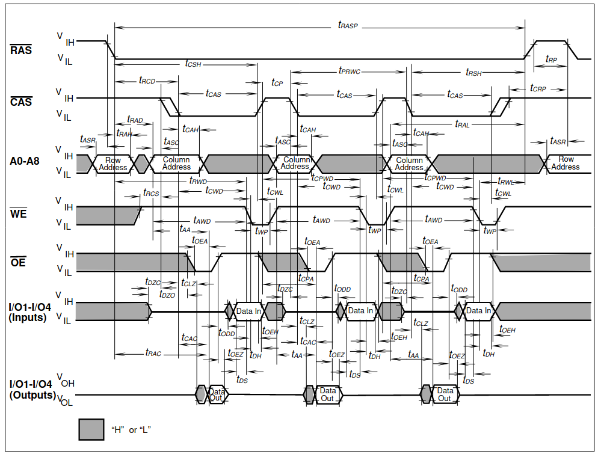

Memories
========

DRAM
~~~~

DRAM history from:
http://doctord.dyndns.org/Courses/UNH/CS216/Ram-Timeline.pdf:

======    ========
Year      Capacity
======    ========
1970      1kbit
1973      4kbit
1976      16kbit
1978      64kbit
1982      256kbit
1986      1Mbit
1988      4Mbit
1991      16Mbit
1994      64Mbit
1998      256Mbit
======    ========

Some DRAM datasheets:

- `16kx1 <https://www.jameco.com/Jameco/Products/ProdDS/2288023.pdf>`_
- `64kx1 <https://www.jameco.com/Jameco/Products/ProdDS/2290535SAM.pdf>`_
- `64kx4 <https://downloads.reactivemicro.com/Electronics/DRAM/NEC%20D41464%2064k%20x%204bit%20DRAM%20Data%20Sheet.pdf>`_
- `256kx1 <https://pdf1.alldatasheet.com/datasheet-pdf/view/37259/SAMSUNG/KM41256A.html>`_
- `256kx4 <https://pdf1.alldatasheet.com/datasheet-pdf/view/45238/SIEMENS/HYB514256B.html>`_
- `1Mx1 <https://datasheetspdf.com/pdf-file/550187/MicronTechnology/MT4C1024/1>`_
- `1Mx16 <https://www.mouser.com/datasheet/2/198/41lv16105b-1169632.pdf>`_
- `4Mx4 <https://www.digikey.com/htmldatasheets/production/1700164/0/0/1/MSM51V17400F.pdf>`_
- `16Mx1 <https://www.digchip.com/datasheets/parts/datasheet/409/KM41C16000CK-pdf.php>`_

There were two memory module formats: 30 pin and 72 pin.

- `<https://en.wikipedia.org/wiki/SIMM>`_
- `<https://www.pjrc.com/tech/mp3/simm/datasheet.html>`_

EDO datasheets:

- `4/8MB module <https://www.digchip.com/datasheets/download_datasheet.php?id=687767&part-number=MT2D132>`_
- `JEDEC standard extract <https://www.ele.uri.edu/iced/protosys/hardware/datasheets/simm/Jedec-Clearpoint-8MB.pdf>`_
- `16/32MB module <https://www.digchip.com/datasheets/download_datasheet.php?id=987285&part-number=TM893GBK32S>`_
- `Another 16/32MB Module <https://docs.rs-online.com/1faa/0900766b80027c7f.pdf>`_
- `Socket ($0.88 apiece) <https://www.peconnectors.com/sockets-pga-cpu-and-memory/hws8182/>`_

Interface to DRAM
-----------------

DRAMs are relatively straightforward to interface to in our system. /LCAS and /UCAS act as byte-selects, but they need to be qualified by /RGN2 and /RNG3 to create space for the 4 RAM banks. These 4 banks then can be either implemented in a single 72-pin DIMM or 4 30-pin DIMM modules.

Due to the loading of all the RAM chips, it's quite likely that /RAS /WE, address and maybe even data needs to be buffered, but that is to be seen.

.. _dram_speeds:

DRAM speeds
-----------

There are four important timing parameters for DRAM timing:

The earliest devices we potentially care about are 256kbit NMOS parts:

=========== ===== ===== ===== ===== ===== =====
Part number       uPD41464         KM41256
----------- ----------------- -----------------
Speed grade  -80   -10   -12   -10   -12   -15
=========== ===== ===== ===== ===== ===== =====
t_rcd        40ns  50ns  60ns  50ns  60ns  75ns
t_cas        40ns  50ns  60ns  50ns  60ns  75ns
t_cp         30ns  40ns  50ns  45ns  50ns  60ns
t_rp         70ns  90ns  90ns  90ns 100ns 100ns
=========== ===== ===== ===== ===== ===== =====

Fast-page-mode devices, such as the one used in late-issue A500 boards have significantly improved timing:

=========== ===== ===== ===== ===== ===== =====
Part number     HYB514256B         MT4C1024
----------- ----------------- -----------------
Speed grade  -50   -60   -70   -6    -7    -8
=========== ===== ===== ===== ===== ===== =====
t_rcd        35ns  45ns  50ns  40ns  50ns  60ns
t_cas        15ns  15ns  20ns  20ns  20ns  20ns
t_cp         10ns  10ns  10ns  10ns  10ns  10ns
t_rp         35ns  40ns  50ns  40ns  50ns  60ns
=========== ===== ===== ===== ===== ===== =====

=========== ====== ====== ====== ======
Part number  KM41C16000C  IS41LV16105B
----------- ------------- -------------
Speed grade   -5     -6     -50    -60
=========== ====== ====== ====== ======
t_rcd        37ns   45ns   37ns   45ns
t_cas        13ns   15ns    8ns   10ns
t_cp         10ns   10ns    9ns    9ns
t_rp         35ns   40ns   30ns   40ns
=========== ====== ====== ====== ======

FPM was a later ('90) invention though. EDO, when introduced in '95 was even faster, but I don't think that matters to us.

To get the best out of the DRAM, we will want page-mode access. However the number of beats we can support is rather limited both by the need for not hogging the bus too long and our limited ability to store the data from a burst.

So, let's look at a few burst sizes and the average cycle time per access:

.. _average_access_times:

.. exec::
    print("====================== ====== ====== ====== ====== ====== ======")
    print("Part number                  uPD41464             KM41256       ")
    print("---------------------- -------------------- --------------------")
    print("Speed grade              -80    -10    -12    -10    -12    -15 ")
    print("====================== ====== ====== ====== ====== ====== ======")
    all_t_rcd = (40,50,60,50, 60, 75)
    all_t_cas = (40,50,60,50, 60, 75)
    all_t_cp  = (30,40,50,45, 50, 60)
    all_t_rp  = (70,90,90,90,100,100)
    all_4b_acc = []
    all_2b_acc = []
    all_1b_acc = []
    for t_rcd, t_cas, t_cp, t_rp in zip(all_t_rcd, all_t_cas, all_t_cp, all_t_rp):
        all_4b_acc.append((t_rcd + 4*t_cas + 4*t_cp + t_rp)/4)
        all_2b_acc.append((t_rcd + 2*t_cas + 2*t_cp + t_rp)/2)
        all_1b_acc.append((t_rcd + 1*t_cas + 1*t_cp + t_rp)/1)
    for all_acc, beats in zip((all_4b_acc, all_2b_acc, all_1b_acc), (4,2,1)):
        acc_str = " ".join(f"{acc:4.0f}ns" for acc in all_acc)
        print(f"{beats}-beat average access  {acc_str}")
    print("====================== ====== ====== ====== ====== ====== ======")

.. exec::
    print("====================== ====== ====== ====== ====== ====== ======")
    print("Part number                  HYB514256B            MT4C1024     ")
    print("---------------------- -------------------- --------------------")
    print("Speed grade              -50    -60    -70    -6     -7     -8  ")
    print("====================== ====== ====== ====== ====== ====== ======")
    all_t_rcd = (35,45,50,40,50,60)
    all_t_cas = (15,15,20,20,20,20)
    all_t_cp  = (10,10,10,10,10,10)
    all_t_rp  = (35,40,50,40,50,60)
    all_4b_acc = []
    all_2b_acc = []
    all_1b_acc = []
    for t_rcd, t_cas, t_cp, t_rp in zip(all_t_rcd, all_t_cas, all_t_cp, all_t_rp):
        all_4b_acc.append((t_rcd + 4*t_cas + 4*t_cp + t_rp)/4)
        all_2b_acc.append((t_rcd + 2*t_cas + 2*t_cp + t_rp)/2)
        all_1b_acc.append((t_rcd + 1*t_cas + 1*t_cp + t_rp)/1)
    for all_acc, beats in zip((all_4b_acc, all_2b_acc, all_1b_acc), (4,2,1)):
        acc_str = " ".join(f"{acc:4.0f}ns" for acc in all_acc)
        print(f"{beats}-beat average access  {acc_str}")
    print("====================== ====== ====== ====== ====== ====== ======")

.. exec::
    print("====================== ====== ====== ====== ======")
    print("Part number             KM41C16000C  IS41LV16105B ")
    print("---------------------- ------------- -------------")
    print("Speed grade              -5     -6     -50    -60 ")
    print("====================== ====== ====== ====== ======")
    all_t_rcd = (37,45,37,45)
    all_t_cas = (13,15, 8,10)
    all_t_cp  = (10,10, 9, 9)
    all_t_rp  = (35,40,30,40)
    all_4b_acc = []
    all_2b_acc = []
    all_1b_acc = []
    for t_rcd, t_cas, t_cp, t_rp in zip(all_t_rcd, all_t_cas, all_t_cp, all_t_rp):
        all_4b_acc.append((t_rcd + 4*t_cas + 4*t_cp + t_rp)/4)
        all_2b_acc.append((t_rcd + 2*t_cas + 2*t_cp + t_rp)/2)
        all_1b_acc.append((t_rcd + 1*t_cas + 1*t_cp + t_rp)/1)
    for all_acc, beats in zip((all_4b_acc, all_2b_acc, all_1b_acc), (4,2,1)):
        acc_str = " ".join(f"{acc:4.0f}ns" for acc in all_acc)
        print(f"{beats}-beat average access  {acc_str}")
    print("====================== ====== ====== ====== ======")

.. _dram_timing:

Timing Diagrams
---------------

The timing of DRAM signals will have to be discretized to clock-edges.

For NMOS RAMs, we will use the following timing:

Single-access:
::

     CLK __/^^\__/^^\__/^^\__/^^\__/^^\__/^^\
    nRAS ^^^^^\_____/^^^^^\_____/^^^^^^^^^^^^
    nCAS ^^^^^^^^\__/^^^^^^^^\__/^^^^^^^^^^^^
    nWE  ^^^^^^^^^^^^^^^^^^^^^^^^^^^^^^^^^^^^
    Data ----------<>----------<>------------

::

     CLK __/^^\__/^^\__/^^\__/^^\__/^^\__/^^\
    nRAS ^^^^^\_____/^^^^^\_____/^^^^^^^^^^^^
    nCAS ^^^^^^^^\__/^^^^^^^^\__/^^^^^^^^^^^^
    nWE  ^^^^^^^^\__/^^^^^^^^\__/^^^^^^^^^^^^
    Data --------<====>------<====>----------

And a 4-beat burst would have this waveform:

::

     CLK __/^^\__/^^\__/^^\__/^^\__/^^\__/^^\
    nRAS ^^^^^\_______________________/^^^^^\
    nCAS ^^^^^^^^\__/^^\__/^^\__/^^\__/^^^^^^
    nWE  ^^^^^^^^^^^^^^^^^^^^^^^^^^^^^^^^^^^^
    Data ----------<>----<>----<>----<>------

::

     CLK __/^^\__/^^\__/^^\__/^^\__/^^\__/^^\
    nRAS ^^^^^\_______________________/^^^^^\
    nCAS ^^^^^^^^\__/^^\__/^^\__/^^\__/^^^^^^
    nWE  ^^^^^^^^\__/**\__/**\__/**\__/^^^^^^
    Data --------<=====X=====X=====X=====>---

For FPM DRAMs, we can afford significantly higher clock-rates, but the timing will have to change slightly. We need to delay nCAS by half a cycle because while t_cas is much shorted, t_rcd doesn't change all that much.

::

     CLK __/^^\__/^^\__/^^\__/^^\__/^^\__/^^\
    nRAS ^^^^^\________/^^\________/^^^^^^^^^
    nCAS ^^^^^^^^^^^\__/^^^^^^^^\__/^^^^^^^^^
    nWE  ^^^^^^^^^^^^^^^^^^^^^^^^^^^^^^^^^^^^
    Data -------------<>----------<>---------

::

     CLK __/^^\__/^^\__/^^\__/^^\__/^^\__/^^\
    nRAS ^^^^^\________/^^\________/^^^^^^^^^
    nCAS ^^^^^^^^^^^\__/^^^^^^^^\__/^^^^^^^^^
    nWE  ^^^^^^^^^^^\__/^^^^^^^^\__/^^^^^^^^^
    Data -----------<====>------<====>-------

::

     CLK __/^^\__/^^\__/^^\__/^^\__/^^\__/^^\
    nRAS ^^^^^\__________________________/^^\
    nCAS ^^^^^^^^^^^\__/^^\__/^^\__/^^\__/^^^
    nWE  ^^^^^^^^^^^^^^^^^^^^^^^^^^^^^^^^^^^^
    Data -------------<>----<>----<>----<>---

::

     CLK __/^^\__/^^\__/^^\__/^^\__/^^\__/^^\
    nRAS ^^^^^\__________________________/^^\
    nCAS ^^^^^^^^^^^\__/^^\__/^^\__/^^\__/^^^
    nWE  ^^^^^^^^^^^\__/**\__/**\__/**\__/^^^
    Data -----------<=====X=====X=====X=====>

.. note:: For write operations, data is held for an extra half-cycle on the bus. This is not strictly necessary for DRAMs but becomes useful when dealing with peripherals or FLASH ROMs, that have a non-0 hold-time requirement.

I suppose there should be a third, compatibility mode as well, at least for the CPU, that works with anything albeit slowly:

::

     CLK __/^^\__/^^\__/^^\__/^^\__/^^\__/^^\__/^^\
    nRAS ^^^^^\___________/^^^^^\___________/^^^^^^
    nCAS ^^^^^^^^^^^\_____/^^^^^^^^^^^\_____/^^^^^^
    nWE  ^^^^^^^^^^^^^^^^^^^^^^^^^^^^^^^^^^^^^^^^^^
    Data ----------------<>----------------<>------

Here's the rub though: if I were designing the access cycles in the early '80s, I would not have known about FPM timings. I would have designed for the first set of timing diagrams and would get surprised when FPM memories came out and would need a different timing. At the same time, FPM memories do work with the old timing, provided I don't increase the clock rate. And going to an almost 2x increase in clock frequency certainly means a new chip revision anyway. So, I would say, the bus-masters support either of the first two timing, but not the compatible one.

Double-pumped interface
-----------------------

This is an interesting idea: since DRAMs only really care about data while nCAS is low, we could double-pump the data-bus and drive two banks of memory over the same wires:

::

     CLK  __/^^\__/^^\__/^^\__/^^\__/^^\__/^^\__/^^\
    nRAS  ^^^^^\__________________________/^^^^^^^^\
    nCASa ^^^^^^^^\__/^^\__/^^\__/^^\__/^^^^^^^^^^^^
    nCASb ^^^^^^^^^^^\__/^^\__/^^\__/^^\__/^^^^^^^^^
    nWE   ^^^^^^^^^^^^^^^^^^^^^^^^^^^^^^^^^^^^^^^^^^
    DataA ----------<>----<>----<>----<>------------
    DataB -------------<>----<>----<>----<>---------
    Data  ----------<>-<>-<>-<>-<>-<>-<>-<>---------

::

     CLK  __/^^\__/^^\__/^^\__/^^\__/^^\__/^^\__/^^\
    nRAS  ^^^^^\__________________________/^^^^^^^^\
    nCASa ^^^^^^^^\__/^^\__/^^\__/^^\__/^^^^^^^^^^^^
    nCASb ^^^^^^^^^^^\__/^^\__/^^\__/^^\__/^^^^^^^^^
    nWE   ^^^^^^^^\_______________________/^^^^^^^^^
    Data  --------<==X==X==X==X==X==X==X==>---------

There are a few (not insurmountable) problems with this technique:

#. First a non-problem: writes are actually OK as the RAM captures data on the falling edge of nCAS and the hold-time requirements are less stringent then the minimum width of nCAS.
#. The DRAM has a pretty lengthy hold time on the data after the rising edge of nCAS. In fact, the hold and setup times are such that the two banks may fight for the bus in the center of the nCAS cycle. Not a problem if our setup/hold time requirements are narrow enough, but still stresses the I/O drivers. Probably the easiest solution is to have a set of series resistors with the data pins. That impacts rise and fall times though, so one should be careful.
#. The burst is one cycle longer. Even though technically only a half cycle is needed, that would make the start of the subsequent cycle fall on the wrong edge of the clock. So, either we double the (internal) clock-rate, or we wait an extra half clock cycle in pre-charge.

For FPM memories, the usual change applies: nCASx is delayed by half a cycle, trading it for a half-cycle shorter pre-charge. The overall cycle-length (in clock cycles) remains the same, but the bandwidth roughly doubles.

Even with all that, it's intriguing that we can double the DRAM bandwidth for such a small cost.

To make use of this, though we would need 2 extra pins to gain a 32-bit bus, or we can lose 8 data-bits and stay at 16-bits.

EPROM
~~~~~

Timeline (from https://en.wikipedia.org/wiki/EPROM):

======    ========
Year      Capacity
======    ========
1975      2704
1975      2708
1977      2716
1979      2732
1981      2764 (https://timeline.intel.com/1981/a-new-era-for-eprom)
1982      27128 (https://timeline.intel.com/1982/the-eprom-evolution-continues)
?         27256
?         27512
1986      27010 (https://timeline.intel.com/1986/one-megabit-eprom)
======    ========

Interface
---------

To get to the EPROM, we would need to latch the first address cycle, and only enable nOE and nCE on the second address cycle, when the full address is available. We can use the first address cycle for some pre-decoding though.

.. _eeprom_timing:

Timing
------

Here's a typical datasheet: https://datasheet.octopart.com/D27256-2-Intel-datasheet-17852618.pdf

Access times are 250ns, though there are several speed-grades available.

By '91, CMOS EPROMs were available with access times roughly half of that: 120ns was the highest speed-grade.

At that time same-capacity (and speed) FLASH parts started to appear too - not 5V programmable parts though. They required ~10ns hold-times on data (relative to the rising edge of nWE), which is something that DRAMs didn't have.

To work with these slow devices, several wait-states need to be inserted (3 minimum). Below are single-beat accesses, but bursts work just as well since timing is solely derived from nCAS.

::

                    <-- wait states -->
     CLK __/^^\__/^^\__/^^\__/^^\__/^^\__/^^\
    nRAS ^^^^^\_______________________/^^^^^\
    nCAS ^^^^^^^^\____________________/^^^^^^
    nWE  ^^^^^^^^^^^^^^^^^^^^^^^^^^^^^^^^^^^^
    nCE  ^^^^^^^^\____________________/^^^^^^
    Data ----------------------------<>------

::

                    <-- wait states -->
     CLK __/^^\__/^^\__/^^\__/^^\__/^^\__/^^\
    nRAS ^^^^^\_______________________/^^^^^\
    nCAS ^^^^^^^^\____________________/^^^^^^
    nWE  ^^^^^^^^\____________________/^^^^^^
    nCE  ^^^^^^^^\____________________/^^^^^^
    Data --------<=======================>---

For later, FPM-style operation, the same signals look like this:

::

                    <-- wait states -->
     CLK __/^^\__/^^\__/^^\__/^^\__/^^\__/^^\
    nRAS ^^^^^\_______________________/^^^^^\
    nCAS ^^^^^^^^^^^\____________________/^^^
    nWE  ^^^^^^^^^^^^^^^^^^^^^^^^^^^^^^^^^^^^
    nCE  ^^^^^^^^^^^\____________________/^^^
    Data -------------------------------<>---

::

                    <-- wait states -->
     CLK __/^^\__/^^\__/^^\__/^^\__/^^\__/^^\
    nRAS ^^^^^\__________________________/^^\
    nCAS ^^^^^^^^^^^\____________________/^^^
    nWE  ^^^^^^^^^^^\____________________/^^^
    nCE  ^^^^^^^^^^^\____________________/^^^
    Data -----------<=======================>
