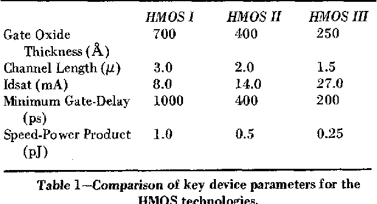
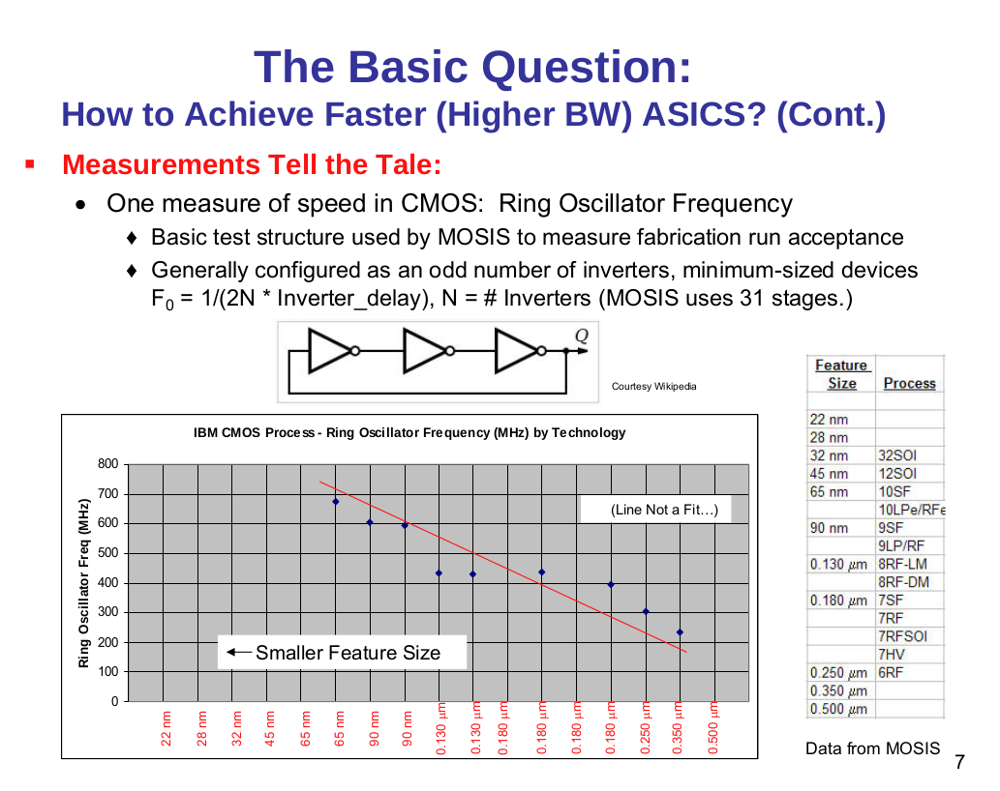

.. _silicon_tech:

Silicon Development As If It Was 1982
=====================================

As I mentioned in the :ref:`introduction`, the goal is to develop a system for a market introduction in 1984. For that, silicon development was going to need to happen during 1982. According to `Wikipedia <https://en.wikipedia.org/wiki/Semiconductor_device_fabrication>`_, the leading-edge process node for that era was 1.5 to 1 micron. 3 micron must have been main-stream and mature being introduced in '77. So I will assume, I have access to 3 micron technology. That's the node for the original MC68000, the 8086 and - curiously - the ARM1 as well, though that came much later.

But, how one does development in 3 micron NMOS in 2023? In short, one doesn't. I need a proxy. I need to figure out how to translate results from a modern process to these ancient ones?

I've found one `article <https://www.semanticscholar.org/paper/HMOS-III-technology-Liu-Fu/898e1109886793a09fcdef2c4133be6acb902e67>`_ where a basic comparison of HMOS 1/2/3 is shown:

  Basic HMOS node comparison

There is also a study on speeds of various, more modern CMOS processes.

  `source <https://psec.uchicago.edu/workshops/fast_timing_conf_2011/system/docs/25/original/110429_psec_workshop_drake_size_dependence.pdf>`_

From this, a 130nm process should have a ring-oscillator speed of about 430MHz, which translates to an inverter delay of about 37ps. We will see in a minute, why that is the node to pay attention to.

From the first table we see that HMOS I (a 3 micron process) has a minimum gate-delay (I'm going to say that's an inverter) of 1ns.

The feature size ratio between the two processes is 23:1. The speed ratio is 27:1. I would say, that's a pretty good fit. In other words, `Denard <https://en.wikipedia.org/wiki/Dennard_scaling>`_ scaling is alive and well.

So, what we can do is this: use Denard scaling to translate the design targets (area and speed) from 3 micron to 130nm and use that process during the process.

Why 130nm in particular? Because Google's `Open Silicon <https://opensource.googleblog.com/2022/05/Build%20Open%20Silicon%20with%20Google.html>`_ initiative give access to a PDK and a complete tool flow to target that node.

What about packaging though? The vast majority of the chips developed and used in that era used DIP packages. These were common up to 40 pins, though variants existed all the way up to 64 pins. During the design it's best to limit ourselves as best as we can to 40 pins and only breach that if there's a really large gain to be had: packages beyond 40 pins must have come with a significant premium.
